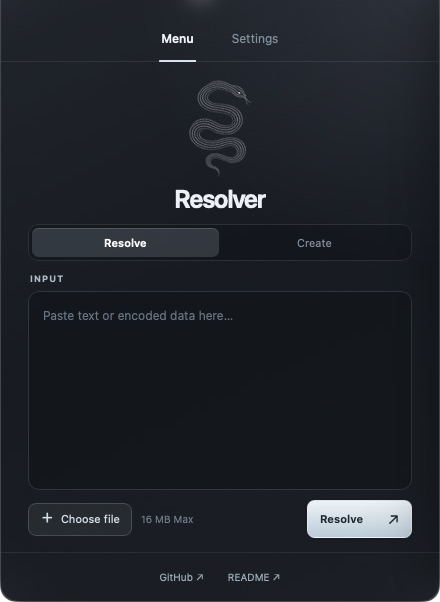
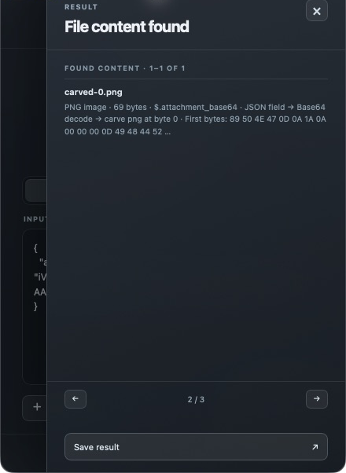
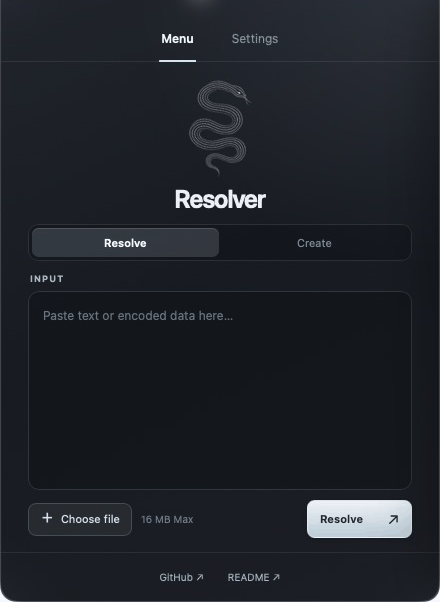

# LayerSift

<p align="center"></p>

LayerSift is an offline desktop app and CLI for inspecting encoded data and recovering embedded files. Give it text, a JSON or SQL dump, or a local file; it reports where content was found and which steps opened it. It can also create Base64 text and cryptographic digests.

[](https://github.com/Exaaiser/LayerSift/actions/workflows/ci.yml)

<p align="center">
  
  
</p>

Try the [small example files](examples/README.md): recover an email from JSON or SQL, open three transformation layers, extract a PNG, or use a known ZIP password. Each example has documented expected content and fingerprints checked by CI.

### A 30-second walkthrough

Paste the JSON fixture → Resolve → inspect the recovered PNG and its bytes → Save result.

<p align="center"></p>

These are actual Mac app captures with pauses between the five steps. The recovered PNG was saved and its bytes checked against the example's expected fingerprint.

**Development source after v0.3.0:** the desktop now also verifies file checksums from Create and shows an optional password field when a ZIP file is selected in Resolve. These additions are prepared for the next combined release. The v0.3.0 CLI already supports checksum verification and known ZIP passwords.

## Downloads

Get the latest files from [GitHub Releases](https://github.com/Exaaiser/LayerSift/releases). The Mac build supports Apple Silicon (arm64); the Windows preview targets x64 PCs.

| File | Use |
| --- | --- |
| `LayerSift-macos-arm64.dmg` | Recommended desktop download. Open the disk image and drag `LayerSift.app` to Applications. |
| `LayerSift-macos-arm64.zip` | Alternative desktop download. Unzip to get `LayerSift.app`. |
| `layersift-cli-macos-arm64.tar.gz` | Terminal tool only; it does not contain the desktop app. Extract it, then run `./layersift`. |
| `LayerSift-windows-x64-setup.exe` | Windows desktop installer. Run it to install the app. |
| `layersift-cli-windows-x64.zip` | Windows terminal tool only. Extract it, then run `layersift.exe`. |
| `SHA256SUMS.txt` | Checksums for all downloads. |

The Mac app has a valid ad hoc signature, but is not signed with an Apple Developer ID or notarized. On first launch, macOS may require you to open **System Settings → Privacy & Security** and choose **Open Anyway**. The Windows installer is not code signed and may also show a warning. Review the source and build it locally if you prefer. The desktop app runs locally and does not upload the supplied data. CI installs and launches the Windows app; visual feedback on a Windows PC is welcome.

### Desktop quick start

1. Paste text or choose a file, up to 16 MB.
2. Choose **Resolve** to inspect input, or **Create** and pick Base64 or a hash method.
3. Read the result panel. Recovered files show their source, transformation steps, byte size, and a short hex preview when the content is binary.
4. Select **Save result** to write a report and recovered files. The default location is `~/Documents/LayerSift/`.

**Settings** lets you choose a save folder or create a new folder inside the current location. LayerSift remembers the selected location on that computer. Each save creates a separate `analysis-*` folder. The desktop analyzer continues to try single-byte XOR keys against recognized file headers. Known Caesar shifts and XOR keys can be supplied through the CLI.

In the development app, selecting a file with a recognized ZIP header shows an optional **ZIP password** field in Resolve. Enter a known password and run the analysis. The field is cleared after the action, and the password is excluded from saved reports. The CLI can also supply a password for an embedded archive.

### Verify a file checksum (development app)

1. Choose **Create** and a hash method such as **SHA-256**.
2. Enable **Verify a file checksum**, choose a file, and paste its expected hexadecimal digest.
3. Select **Verify**. The result shows **Match** or **Mismatch**; the next result page shows both digests. You can copy the actual digest or save the verification report.

For a ready-to-use check, use `examples/checksum.txt` with the value in `examples/checksum.sha256`. Verification compares exact file bytes. A match checks agreement with the supplied value; obtain that value from a trusted source if you need to establish authenticity.

See the [checksum result](docs/images/checksum.png) and [ZIP password controls](docs/images/zip-password.png) captured from the development app.

### CLI quick start

```sh
tar -xzf layersift-cli-macos-arm64.tar.gz
./layersift
```

Running `./layersift` in Terminal opens a guided menu. You can also use commands directly:

```sh
./layersift inspect --text 'dXNlckBleGFtcGxlLmNvbQ=='
./layersift inspect --file sample.json --json
./layersift extract --file archive.zip --zip-password secret --out ./recovered
./layersift codec encode base64 --text 'hello'
./layersift hash make sha256 --text 'hello'
./layersift hash identify 2cf24dba5fb0a30e26e83b2ac5b9e29e1b161e5c1fa7425e73043362938b9824
```

Run `./layersift --help` for every command. The CLI also supports Base64 and hex decoding, Caesar and XOR transforms, and digest verification. Files are created without overwriting existing output.

On Windows, extract `layersift-cli-windows-x64.zip` and run `layersift.exe` in a terminal. Running it without arguments opens the same guided menu.

## Supported analysis

| Area | Support |
| --- | --- |
| Encoded fields | Base64 and hex in plain text, JSON strings, and SQL string literals |
| Layers | Base64, hex, gzip, zlib; up to four analysis steps |
| Basic ciphers | CLI: Caesar with a supplied shift and XOR with a supplied key; desktop and CLI: single-byte XOR detection for known file signatures |
| Recovered files | Embedded PNG, JPEG, PDF, and ZIP members; ZIP passwords supplied through the CLI |
| Hashes | MD5, SHA-1, SHA-2, SHA-3, and BLAKE2 creation; CLI verification; possible format reporting based on digest shape |
| Reports | Source and transformation steps, byte counts, SHA-256 fingerprints, JSON report, local extraction |

A hash digest cannot be decoded to recover its original input. A 64-character hexadecimal value can match several algorithms, so LayerSift lists possibilities without claiming a certain identification. Password guessing and general decryption are outside the scope of this release.

The analyzer uses bounded search: 16 MiB CLI input (16 MB in the desktop app), 32 MiB expanded layers, 256 candidates, and 256 artifacts per run. SQL scanning looks for quoted values in text dumps; it is not a complete SQL parser. Embedded file detection relies on recognizable signatures and boundaries, so results can include false positives or miss custom formats. The app never executes inspected content.

Read [how the analyzer works](docs/architecture.md) for the shared Rust core, layer search, file handling, limits, and verification decisions.

## Build from source

Install stable Rust and Node.js. For the CLI:

```sh
cargo test --locked
cargo build --release --locked
./target/release/layersift --help
```

For the desktop app on macOS, install the [Tauri prerequisites](https://v2.tauri.app/start/prerequisites/), then run:

```sh
npm ci
npm run tauri -- dev
```

To create a local ad hoc signed app bundle:

```sh
npm run tauri -- build --bundles app
codesign --verify --deep --strict --verbose=2 src-tauri/target/release/bundle/macos/LayerSift.app
```

The built app is under `src-tauri/target/release/bundle/macos/`. On Windows, install the [Windows Tauri prerequisites](https://v2.tauri.app/start/prerequisites/) and run `npm run tauri -- build --bundles nsis`; the installer is written under `src-tauri/target/release/bundle/nsis/`.

## Design references

The layer search is informed by [CyberChef Magic](https://github.com/gchq/CyberChef/wiki/Automatic-detection-of-encoded-data-using-CyberChef-Magic). Embedded file extraction is informed by [Binwalk](https://github.com/ReFirmLabs/binwalk). Hash shape reporting follows the caveat documented by [hashcat](https://github.com/hashcat/hashcat/blob/master/docs/releases_notes_v7.0.0.md#14-hash-mode-autodetection): one output format can match multiple algorithms. LayerSift does not copy their code or databases.
