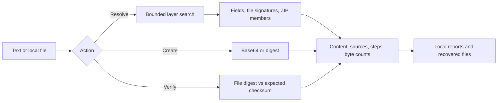

# How LayerSift works

LayerSift has a Rust analysis library, a command line interface, and a Tauri desktop app. The desktop frontend selects an action and presents the result; analysis, hashing, file reads, and report writes happen in Rust. Both interfaces use the same analysis and hash implementations.

## Layer search

The analyzer starts with the input bytes and candidate fields from JSON strings, quoted SQL values, and text tokens. It searches breadth first through Base64, hexadecimal, gzip, and zlib transformations. Each candidate retains its source and transformation steps. SHA-256 fingerprints prevent repeated content from being processed again.

Recognizable PNG, JPEG, and PDF content is carved from candidate bytes. ZIP archives are inspected for members. PNG carving checks chunk boundaries and CRCs; signature recognition alone does not prove that every recovered file is valid. Results include byte counts, SHA-256 fingerprints, and a short text or hexadecimal preview so users can inspect what was recovered.

Single-byte XOR detection tries keys against known file headers on inputs up to 1 MiB. It is a heuristic for simple transformations. Known Caesar shifts and arbitrary XOR keys can be supplied through the CLI.

## Bounds and file writes

The search allows at most four transformation steps, 256 visited candidates, and 256 artifacts. Expanded layers and individual ZIP members are limited to 32 MiB. These are per-layer and per-member limits, not a 32 MiB limit on the entire process. Desktop input is limited to 16,000,000 bytes; CLI analysis input is limited to 16 MiB.

The desktop reads at most the input limit plus one byte, including when a file grows after its size was checked. Decompression reads are also bounded. SQL scanning finds quoted values in text dumps; it does not execute SQL or implement a full SQL parser. Inspected content is never executed.

The desktop flattens extracted filenames, sanitizes them, and prefixes each one with an index. Member paths such as `../note.txt` are not used as output paths. Saves go into a newly created `analysis-*` directory under the user's selected folder, and recovered files use exclusive creation rather than overwriting existing files.

## ZIP passwords

The desktop recognizes common ZIP headers when a file is selected and shows an optional password field in Resolve. It uses the password provided by the user; it does not guess passwords. The field is cleared after the action and whenever the file selection changes. Passwords are not stored in app settings or saved reports. This does not promise secure erasure of all password copies from process memory.

The CLI can also supply a known password for an archive embedded in another input. The desktop's contextual field currently applies to selected files that begin with a recognized ZIP header.

## Hashes and verification

Creation hashes the exact input bytes. File checksum verification compares the chosen algorithm's digest against a supplied hexadecimal value, accepting surrounding whitespace and either letter case. It validates the expected digest's length and character set, and reports Match or Mismatch with both values. Line endings and other byte changes matter.

A matching checksum establishes agreement with the supplied value. Authenticity depends on obtaining that value from a trusted source. Hash format suggestions in Resolve use length and character set; several algorithms can share a format. They do not identify the exact algorithm or recover the original input.

## Evidence and limitations

- [Demo fixtures](../examples/README.md) contain synthetic inputs with expected recovered fingerprints and steps. `scripts/check-examples.py` exercises them through the actual CLI on both CI platforms.
- Desktop backend tests cover checksum matches and mismatches, malformed digests, ZIP detection, password-assisted recovery, password exclusion from reports, and saving into the selected folder.
- CI builds the Mac app, verifies signatures after DMG/ZIP packaging, builds the Windows NSIS installer, installs it, and checks that the installed app remains running after startup.
- Automated Windows startup checks do not verify every visual detail. The Mac app is ad hoc signed, and the distributed builds are not notarized or signed with commercial distribution certificates.

Implementation: [analysis library](../src/analysis.rs), [hash methods](../src/hashing.rs), [desktop commands](../src-tauri/src/lib.rs), and [CI workflow](../.github/workflows/ci.yml).
